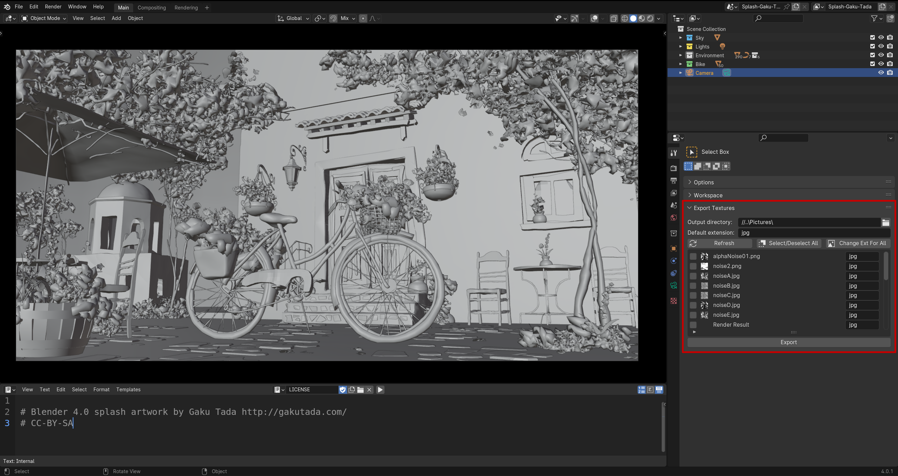

# Blender Texture Exporter (Texport)

Easily export selected textures from `.blend` file to directory of your choice.

## Installation

To install the add-on, download the texport-x-y-z.zip file attached to the [latest release](https://github.com/Andrew2a1/texport/releases) and install it as a regular blender add-on (User Preferences -> Addons -> Install from file).

## Usage

A new panel, "Export Textures" is created in `Properties -> Tool` after add-on is enabled in preferences.

Select output directory along with images that you would like to export and press `Export` button to save images.

Image list supports filtering and sorting:

All image formats specified [here](https://docs.blender.org/manual/en/latest/files/media/image_formats.html) are supported.

### Settings

Options:
- "Output directory" - Path to the output directory, if empty then files will be stored in the directory of `.blend` file
- "Default extension" - Extension to apply for all images from list when pressing button `Change Ext For All`

Buttons:
- "Refresh" - Refresh image list (plugin should automatically refresh it in 5s time intervals)
- "Select/Deselect All" - Toggle selection for all image entries in the list
- "Change Ext For All" - Apply extension stored in `Default extension` to all image entries in the list
- "Export" - Export selected files to `Output directory`
